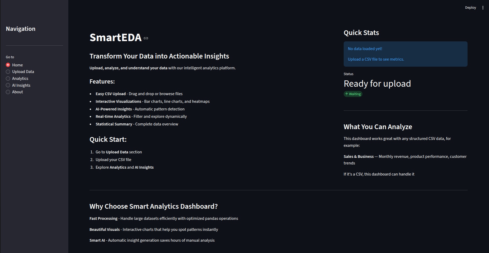
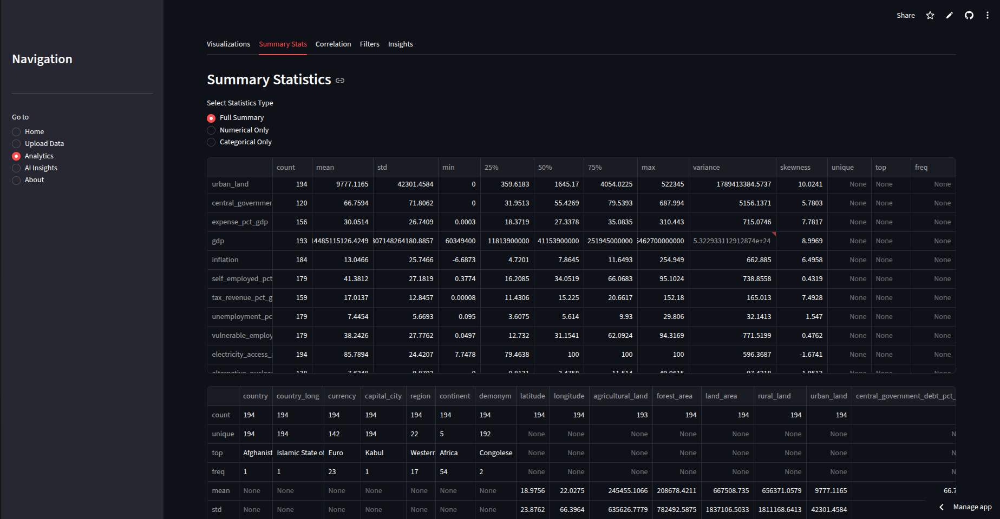
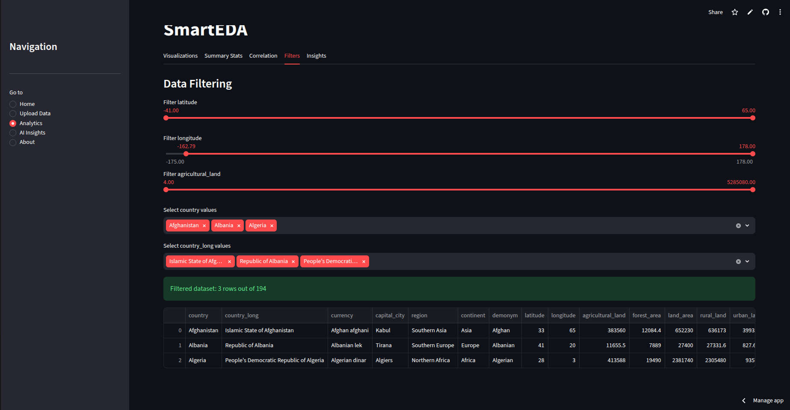
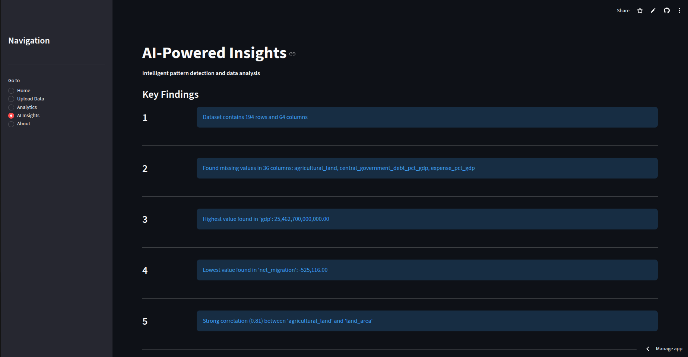
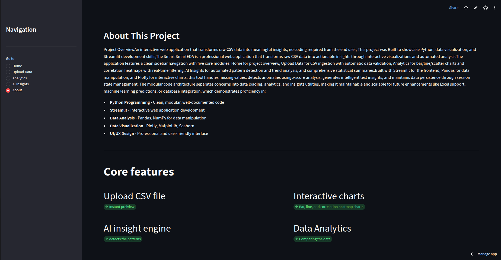

# SmartEDA

## Intelligent Exploratory Data Analysis Platform

SmartEDA is a web-based Exploratory Data Analysis (EDA) application built with Python and Streamlit. It enables users to upload CSV datasets, explore their structure, perform statistical analysis, visualize data through interactive charts, and generate automated insights within a simple and intuitive interface.

The project was developed to demonstrate practical knowledge of data analysis, visualization, and Python application development by providing an end-to-end solution for exploring datasets before machine learning or further analysis.

---

## Features

### Data Import

- Upload CSV datasets
- Automatic dataset loading
- Dataset preview
- Display dataset dimensions
- Column information and data types

### Data Analysis

- Descriptive statistics
- Missing value analysis
- Duplicate value detection
- Numerical and categorical summaries
- Correlation analysis

### Data Visualization

The application provides multiple interactive visualizations, including:

- Correlation Heatmap
- Histograms
- Scatter Plots
- Box Plots
- Bar Charts
- Pie Charts
- Line Charts
- Distribution Analysis

### Automated Insights

- Dataset overview
- Correlation observations
- Missing data summary
- Outlier identification
- Statistical recommendations

---

# Application Screenshots

## Home

<p align="center">

</p>

---

## Dataset Upload

<p align="center">

</p>

<p align="center">

</p>

---

## Analysis Dashboard

<p align="center">

</p>

<p align="center">

</p>

<p align="center">

</p>

<p align="center">

</p>

<p align="center">

</p>

---

## Automated Insights

<p align="center">

</p>

---

## About

<p align="center">

</p>

---

# Technology Stack

| Technology | Purpose |
|------------|---------|
| Python | Core application development |
| Streamlit | Web application framework |
| Pandas | Data manipulation and analysis |
| NumPy | Numerical computations |
| Plotly | Interactive visualizations |
| Matplotlib | Statistical plotting |
| Seaborn | Data visualization |

---

# Project Structure

```text
SmartEDA/
│
├── app.py
│
├── utils/
│   ├── __init__.py
│   ├── analytics.py
│   ├── data_loader.py
│   └── insights.py
│
├── SmartEDA_Images/
│   ├── Home.png
│   ├── Upload_Data1.png
│   ├── Upload_Data2.png
│   ├── Analysis.png
│   ├── Analysis1.png
│   ├── Analysis2.png
│   ├── Analysis3.png
│   ├── Analysis4.png
│   ├── AI_insights.png
│   └── About.png
│
├── requirements.txt
└── README.md
```

---

# Usage

1. Launch the application.
2. Upload a CSV dataset.
3. Review the dataset preview.
4. Explore descriptive statistics.
5. Generate interactive visualizations.
6. Analyze correlations and distributions.
7. Review the automatically generated insights.

---

# Learning Outcomes

This project provided practical experience in:

- Building web applications with Streamlit
- Exploratory Data Analysis (EDA)
- Data preprocessing
- Statistical analysis
- Interactive data visualization
- Writing modular Python applications
- Organizing reusable project components
- Creating user-friendly analytical dashboards

---

# Future Improvements

Potential enhancements include:

- Excel (.xlsx) file support
- Export analysis reports as PDF
- Machine learning model integration
- Time-series analysis
- Interactive filtering
- User authentication
- Cloud deployment
- Additional visualization options

